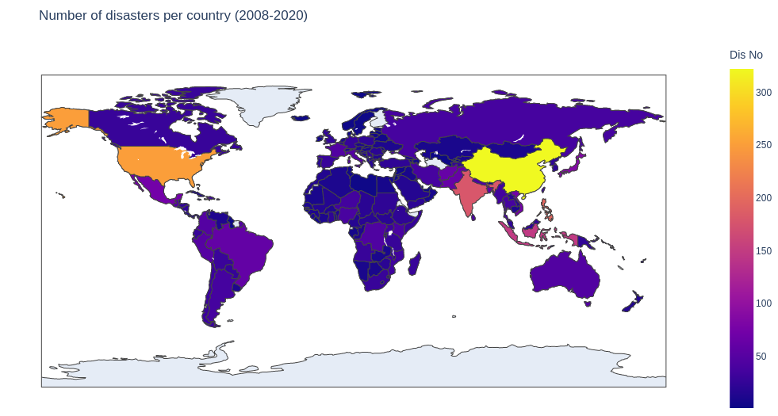
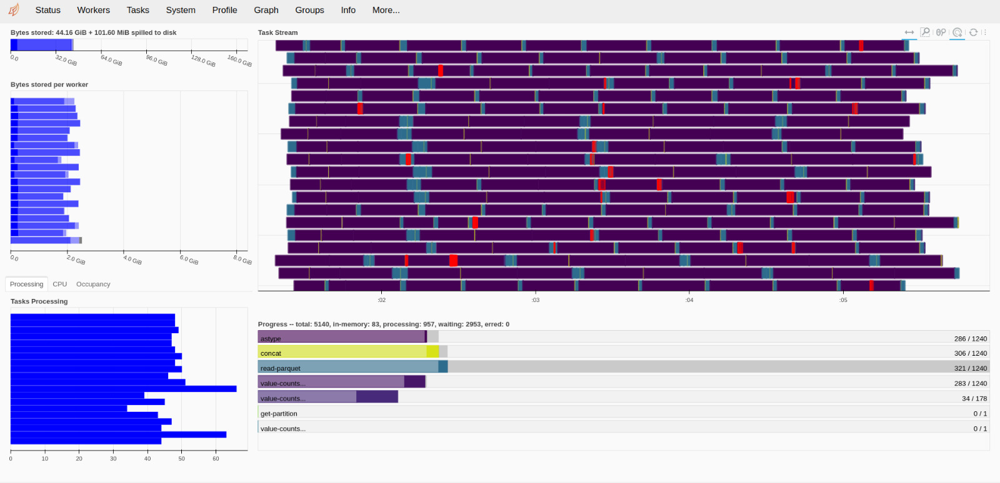
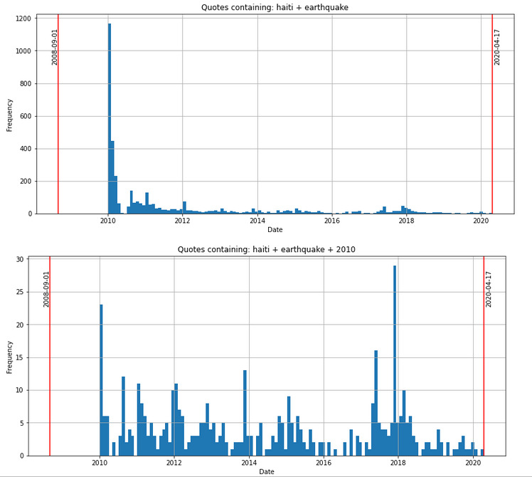

# Title

<!-- TABLE OF CONTENTS -->
<h2 id="table-of-contents"> :book: Table of Contents</h2>

  
Table of Contents

  <ol>
    <li><a href="#abstract"> ➤ Abstract</a></li>
    <li><a href="#research-questions"> ➤ Research questions</a></li>
    <li><a href="#additional-datasets"> ➤ Additional datasets</a>
        <ul>
            <!-- <li><a href="#additional-datasets-speaker-attributes">Speaker attributes</a></li> -->
            <li><a href="#additional-datasets-disasters">Disasters</a></li>
            <li><a href="#additional-datasets-wdi">World development indicators</a></li>
            <li><a href="#additional-datasets-gdelt">GDELT geographic lookup of domains</a></li>
        </ul>  
    </li>
    <li><a href="#folder-structure"> ➤ Folder Structure</a></li>
    <li><a href="#timeline"> ➤ Proposed timeline</a></li>
    <li><a href="#organization"> ➤ Organization within the team</a></li>
    <li><a href="#questions-for-tas"> ➤ Questions for TAs</a></li>
  </ol>

<!-- ABSTRACT -->
<h2 id="abstract"> :pencil: Abstract</h2>

<!-- TODO: A 150 word description of the project idea and goals. What’s the motivation behind your project? What story would you like to tell, and why? -->

Every year, natural disasters happen and often take many lives. After such events, the pages of newspapers are full of quotes from people expressing regret for the unfortunate event. These events often remain in people's memory for a lifetime. What influences how long these events will be talked about years later? Perhaps the number of casualties, total damage induced, or the country of the disaster and its wealth. In this research project, our goal is to explore how much is said about the biggest disasters (such as earthquakes, storms, floods) years after they have occurred and what factors influence this. We will look for answers in the [Quotebank](https://github.com/epfl-dlab/Quotebank) 2008-2020 quotes on disasters taken from the [international disasters database](https://public.emdat.be/data) combined with world development indicators from the [World Data Bank](https://databank.worldbank.org/source/world-development-indicators). To simplify disaster quote detection, we will further look into classifying the quotes by whether they talk about a disaster or not.

<h2 id="research-questions"> :electron: Research questions</h2>
<!-- Research Questions: A list of research questions you would like to address during the project. -->

We propose to answer two questions in this research project.

First, how correctly will NLP models trained on disaster tweets like in [this kaggle challenge](https://www.kaggle.com/c/nlp-getting-started/overview) generalize to classifying disaster quotes in Quotebank? 

Second, what factors influence how long a natural disaster will be talked about in Quotebank quotes from 2008 to 2020? The interesting factors include total deaths, total damage in dollars, country of disaster, wealth indicators of the country, etc.

Given that a comprehensive analysis of these research questions might be challenging, we discard other related and interesting questions like "what is the sentiment towards different disasters and why" and "how does the country of the speaker affect which disasters he is talking about".

<!-- ADDITIONAL DATASETS -->
<h2 id="additional-datasets"> :floppy_disk: Additional datasets</h2>

<!-- TODO: List the additional dataset(s) you want to use (if any), and some ideas on how you expect to get, manage, process, and enrich it/them. Show us that you’ve read the docs and some examples, and that you have a clear idea on what to expect. Discuss data size and format if relevant. It is your responsibility to check that what you propose is feasible. -->

Besides laoding and doing exploratory data analysis on [Quotebank](https://github.com/epfl-dlab/Quotebank) in [quotes_eda.ipynb](quotes_eda.ipynb), we will use two additional datasets:
- [The international disasters database](https://public.emdat.be/data), loaded and analysed in [disasters_eda.ipynb](disasters_eda.ipynb)
- [World Data Bank](https://databank.worldbank.org/source/world-development-indicators), loaded and analysed in [wdi_eda.ipynb](wdi_eda.ipynb)

Besides these datasets, we might use public disaster tweets datasets like the one in [this kaggle challenge](https://www.kaggle.com/c/nlp-getting-started/overview) to use them for disaster quotes classification, if the models prove to be of desired success.

<!-- ADDITIONAL DATASETS SPEAKER ATTRIBUTES -->
<!-- <h3 id="additional-datasets-speaker-attributes">   Speaker attributes</h3>

This dataset helps us to find a connection between the speaker and the quotation when it is about a disaster. We can observe if the speaker is from the same country as the place of the disaster, or she/he is a scientist, expert talking about the event.

Data source: Wikidata -->

<!-- ADDITIONAL DATASETS DISASTERS -->
<h3 id="additional-datasets-disasters"> 1. Disasters</h2>

Data source: [The international disasters database](https://public.emdat.be/data)

We use [the international disasters database](https://public.emdat.be/data) to introduce natural disasters of this century with their most important attributes.<!-- , as we want to find the connection between the attributes of a disaster and the length (or distribution) of the time these disasters are talked about in quotes. --> To enumerate the most important attributes introduced with this dataset, we get the disaster type, total deaths, total damage in dollars, country of disaster, the date, and the reconstruction cost.
<!-- There are also some disaster-type specific attributes like the magnitude of an earthquake on a Richter scale. -->

As noted on the dataset website, the data was compiled from various sources including UN, governmental and non-governmental agencies, insurance companies, research institutes, and press agencies (see Table 2). As there can be conflicting information and figures, CRED has established a method of ranking these sources according to their ability to provide trustworthy and complete data. In the majority of cases, a disaster will only be entered into EM-DAT if at least two sources report the disaster's occurrence in terms of deaths and/or affected persons.

In the [disasters_eda.ipynb](disasters_eda.ipynb) notebook, we have loaded, pre-processed and cleaned, analyzed, and visualized the dataset. 

<!-- WORDL DEVELOPMENT INDICATORS -->
<h3 id="additional-datasets-wdi"> 2. World development indicators</h2>

Data source: https://databank.worldbank.org/source/world-development-indicators

<!-- To supplement the disaster dataset, we have selected 55 different world development indicators from the [World Data Bank](https://databank.worldbank.org/source/world-development-indicators). We took the per-year data from the year 2000 to the year 2020 and for all available countries. Detailed indicator description is given in the metadata csv file `databank_wdi_metadata.csv`, including the source, unit of measure, periodicity, aggregation method, statistical concept and methodology, development relevance, and limitations. Raw data is saved in `databank_wdi_data.csv`, with the preprocessed dataset created in this notebook saved in `databank_wdi_data_clean.csv`. -->

One important factor in how much people talk about a disaster might be the country and its attributes. In this dataset, the most important development indicators of the country can be found, for example GDP, population, fertility rate, and life expectancy at birth. Detailed indicator description is given in the metadata csv file `databank_wdi_metadata.csv`. We would like to observe whether there is a connection between these indicators and the length and distribution of time they talk about the disaster.

In the [wdi_eda.ipynb](wdi_eda.ipynb) notebook, we have loaded, pre-processed and cleaned, analyzed, and visualized the dataset.

<!-- WORLD DEVELOPMENT GDELT -->
<h3 id="additional-datasets-gdelt"> 3. GDELT geographic lookup of domains</h2>

Data source: https://blog.gdeltproject.org/mapping-the-media-a-geographic-lookup-of-gdelts-sources/

The geographical location of newspapers could affect the citations contained in them. Although the quotes in the Quotebank dataset contain links to the article in which they were found, we cannot find out the true geographical location of the news source from the link itself. E.g. theguardian.com and nytimes.com both use .com top-level domain, but they are reporting events in different countries. That's why we decided to choose a GDELT dataset that associates a particular domain with the right country from which that news source comes. This dataset was created from the enormous GDELT dataset, which relied on the strong geographic bias inherent in journalism – the simple fact that news outlets cover events physically proximate to them far more often than they do events on the other side of the world.

<!-- :paw_prints:-->
<!-- FOLDER STRUCTURE -->
<h2 id="folder-structure"> :cactus: Folder Structure</h2>

    .
    │
    ├── datasets
    │   ├── quotebank
    │   │   └── quotes-{year}.parquet
    │   │
    │   ├── gdelt_domains_by_country
    │   │   ├── gdeltdomainsbycountry_may2018.txt
    │   │   └── FIPS_country.txt
    │   │
    │   ├── emdat
    │   │   ├── emdat_public_2021_11_06_clean.csv
    │   │   └── emdat_public_2021_11_06.csv
    │   │
    │   └── wdi
    │       ├── databank_wdi_data.csv
    │       └── databank_wdi_metadata.csv
    │
    ├── quotes_eda.ipynb
    ├── wdi_eda.ipynb  
    └── disasters_eda.ipynb    
 
<!-- METHODS -->
<h2 id="methods"> :mag: Methods</h2>

In tackling the research question of analyzing how long natural disasters will be talked about, the crucial component is to classify whether a specific quote is talking about a specific disaster. We find it challenging to come up with a feasible method of doing so. So far we have considered the following two methods:

<!-- PROPOSED TIMELINE -->
<h2 id="timeline"> :calendar: Proposed timeline</h2>

TODO: 
1. Project idea clarification
2. Additional data collection and processing
3. Data statistical analysis

<!-- PROPOSED TIMELINE -->
<h2 id="organization"> :dart: Organization within the team</h2>

TODO: A list of internal milestones up until project Milestone 3.

<!-- QUESTIONS FOR TAs -->
<h2 id="questions-for-tas"> :question: Questions for TAs (optional)</h2>

Add here any questions you have for us related to the proposed project.
